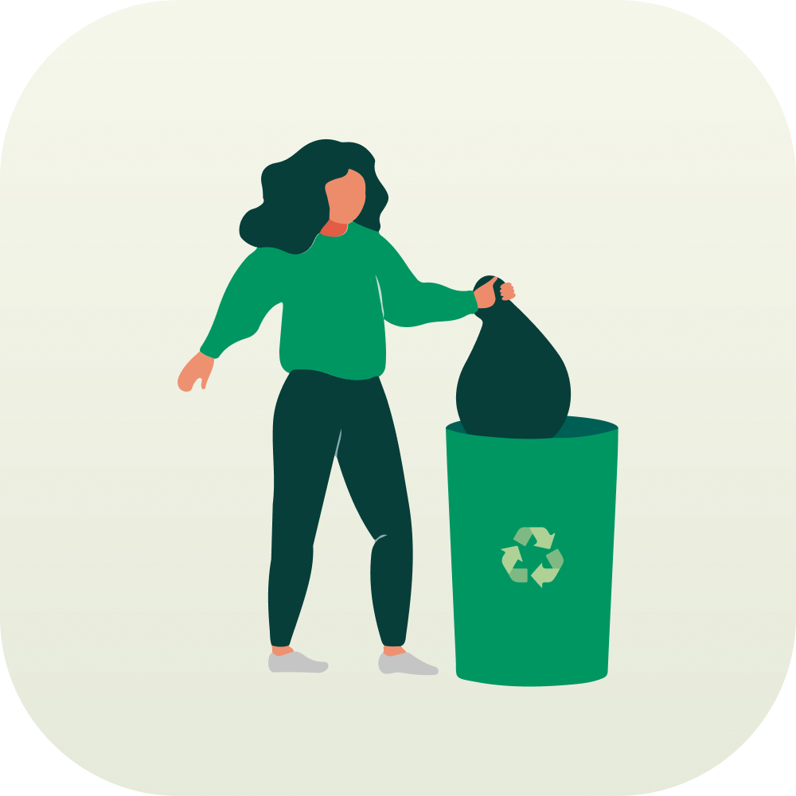

<h1 align="center">
    
</h1>
<h1 align="center">
  DFL - Mobile
</h1>

<p align="center">
  
  
  
  
  
</p>


## 💻 Project
An application that will help you to report garbage outbreaks and find collection points in your city.

## ✨ Technologies

- [ ] JavaScript (w/TypeScript)
- [ ] React
- [ ] React Native
- [ ] Expo
- [ ] Material Icons
- [ ] Axios

## Using the default application

To be able to download the default app on your Android mobile device (the only operating system currently available), visit the [DFL website](https://dfl.vercel.app) and navigate to the download area to install the .apk file of the application.

> To report an issue, please add an [issue](https://github.com/theduardomaciel/dfl-mobile/issues) so the bug can be tracked and resolved.


## Running the project

Use **yarn** or **npm install** to install project dependencies.
Then start the project.

```cl
npm run start
```

## 🔖 Layout

You can view the layout of the project through [this link](https://www.figma.com/file/WSAdXvaBPIDKfDSbqyqvyM/DFL---Mobile?node-id=0%3A1). You need an account on [Figma](http://figma.com/) to access it.

## 📄 License

This project is under the MIT license. See the [LICENSE](LICENSE) file for more details.

<br />
